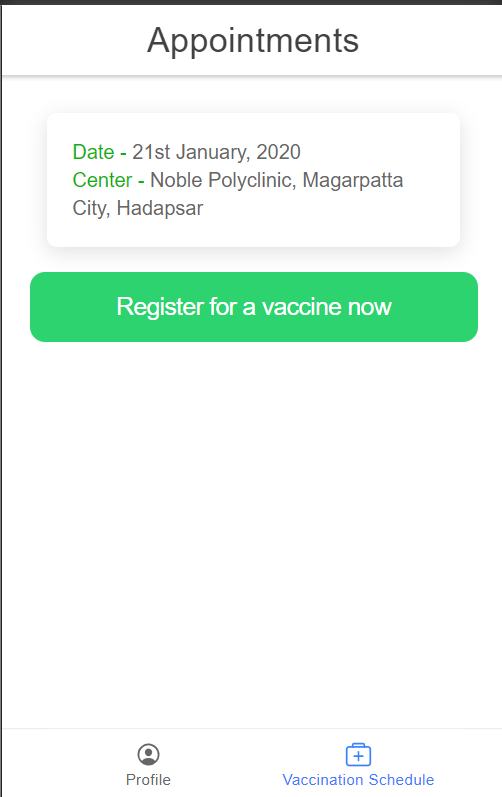

# User Portal for Vaccine Supply Chain System

This repository contains the source code to one of the modules of our vaccine supply chain system - the user portal module. The frontend of the user portal is made with Ionic React and the backend is written in Node.js.

## Launch the app

Run the following command in the project's root directory.
```
ionic serve
```

## UI of the app



## Installation

Use the package manager [pip](https://pip.pypa.io/en/stable/) to install foobar.

```bash
pip install foobar
```

## Usage

```python
import foobar

foobar.pluralize('word') # returns 'words'
foobar.pluralize('goose') # returns 'geese'
foobar.singularize('phenomena') # returns 'phenomenon'
```

## Contributing
Pull requests are welcome. For major changes, please open an issue first to discuss what you would like to change.

Please make sure to update tests as appropriate.

## License
[MIT](https://choosealicense.com/licenses/mit/)